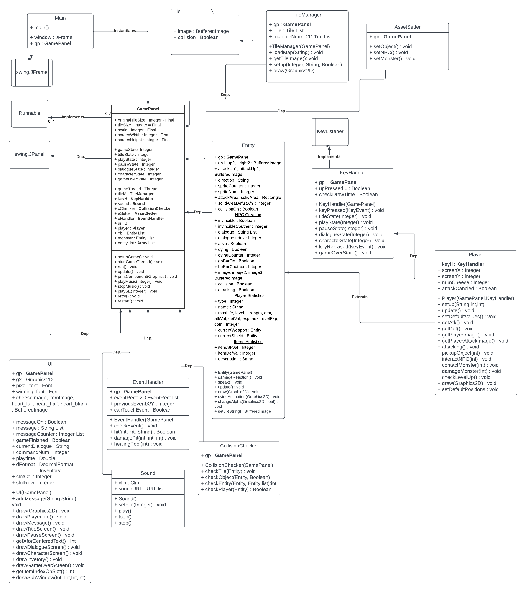

# Requirements Specification for Legend of Nine

## 1. Introduction

### 1.1 Purpose of Product

The purpose of this project is to develop an understanding of game creation as well as use that understanding to further our knowledge in software development. Our group stives to create an interactive game experience that allows players to easily pickup our game and complete it while also having fun. As new game developers, our audience is preferably people with little video game experience. This will allow our team to take feedback and turn it into meaningful results so that people who are unfamiliar with games can have a good experience with what we create. Overall, the product we develop will allow us to form a foundation for something we all enjoy doing and will hopefully lead into future opportunities surrounding the same field of interest. 

### 1.2 Scope of Product

This product is a simple game design that will include game features such as movement, object interaction, and collision mechanics. This product will not include multiplayer capabilities.
### 1.3 Acronyms, Abbreviations, Definitions

The team name "Legend of Nine" will often be abbreviated at "LoN". 

### 1.4 References

https://www.youtube.com/playlist?list=PL_QPQmz5C6WUF-pOQDsbsKbaBZqXj4qSq

## 2. General Description of Product

### 2.1 Context of Product

The overall environment is a game window that allows a user to play the game and interact with the UI.  

## 2.2 Domain Model with Description

The domain model of our project can be seen here.

For further information on design implementation, see the design page. 

## 2.3 Product Functions (general)

Player, NPC characters, objects, and tiles are represented as flat, 2D sprites. The player is able to use W, A, S, and D keys to move up, left, down, and right(respectively). Objects can be interacted with while tiles can be traversed unless they represent a wall. Player can be affected by certain objects and can use objects to achieve tasks. Player can also be attacked by NPC characters or can attack NPC characters.  
## 2.4 User Characteristics and Expectations

Describe your users and their abilities.

User is able to take control of the playable character and should have the following actuator: a hand capable of pressing the W, A, S, and D keys, and the following sensor: Eyes to perceive the screen. User can traverse the game in order to pickup enough pieces of cheese to complete the game.   
## 2.5 Constraints

Constraints for this sytem include the amount of sprites that can be present on the screen during gameplay. Currently, we allow 10 objects to be present for gameplay at 60fps. This would also depend on the machine the user is using to run our game. Right now, The user also must have gradle installed and working with our build in order to run the game. In the future, we hope to implement our game as an executable.

## 2.6 Assumptions and Dependencies

Our product is a java game using the javax.swing.JFrame library which can be compiled using any java interpreter with an updated JDK. 

Our product utilizaes Gradle, which is a functional requirement. 

# 3. Functional Requirements

https://github.com/rhollomon/Legend-of-Nine/blob/main/pages/userstories.md

# 4. System and Non-functional Requirements

## 4.1 External Interface Requirements (User,Hardware,Software,Communications)

Our product has a user interface that draws tiles to display the title screen, pause screen, inventory screen, dialogue boxes, and stats of the player. 
User must be running JDK version 17 and have the latest version of gradle downloaded.

## 4.2 Performance Requirements

1. Gameplay

    4.2.1 Process user input in timely manner. 

    4.2.2 Quick response time for in-game processes. 

    4.2.3 Error-free and seamless experience. 

2. Deliverable (INP)

    4.2.4 Project is able to be installed and deployed to end-users, error-free.

## 4.3 Design Constraints

1. Software Constraints

    4.3.1 Installation of Java Development Kit and Gradle is required to build and run project. 

    4.3.2 Latest version of Java Development Kit (v.20) incompatible with latest version of Gradle (8). JDK 17 or earlier required for builds with Gradle 8. 

2. Hardware Constraints - No significant hardware constraints. 

## 4.4 Quality Requirements

1. Usability

    4.4.1 Concise and informative documentation. 

    4.4.2 Easy to maintain and update. 

    4.4.3 Intuitive design and interface. 
    
2. End-to-end Progression (INP)

    4.4.4 Multiple explorable rooms with enemy sprites and loot.

    4.4.5 Items from previous rooms required to progress to next room.

    4.4.6 Final room with a 'boss' enemy. 

## 4.5 Other Requirements
 

# 5. Appendices

https://github.com/rhollomon/Legend-of-Nine/tree/main/pages

